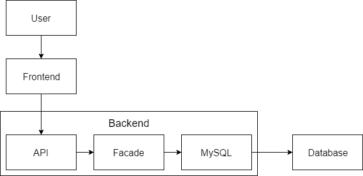

## HackerNews Documentation

### System Overview  

The system contains 2 subsystems and a database.  
The subsystems consist of: A frontend primarily made in Angular, and a backend made in Java.  
For the database we have used a MySQL Database.

### System Architecture

Information regarding machine setup.

### Accessibility

Information about how to access machines.

### Dataflow

### Bug reports and Issues

aaa

### Restart of components

aaa

### Inner System information

aaaa